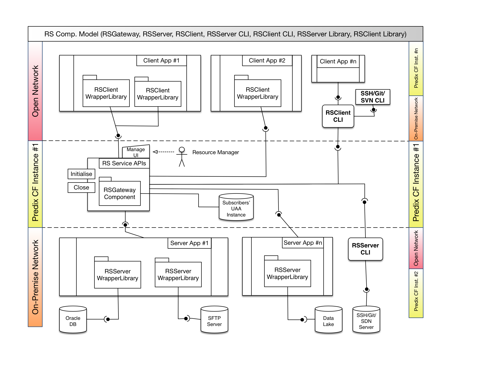

# rs-connectivity-service

* [Vision](#vision) 
* [Features Implemented](#features-implemented) 
* [Work in progress](#work-in-progress) 
* [Installation](#installation) 
* [Generate a self-signed TLS/SSL Certificate with OpenSSL](#generate-a-self-signed-tlsssl-certificate-with-openSSL) 
* [Usage](#usage)
   * [Usage Modeling](#usage-modeling)
   * [Gateway](#gateway)
   * [Client](#client)
   * [Gateway](#gateway)
   * [Event handling](#event-handling)
* [Reference](#reference)
   * [Release Notes](#release-notes)

##Vision
- Create smarter Distributed Computing System through connectivity.
- Provide manageable and scalable connectivity service for Internal/External GE customers and extend the Predix platform capability.

##Features Implemented 
- Support Secured Websocket Connection (SSL/TLS).
- Support Corporate Proxy Services.
- Support Multi-tenancy (Multi-Servers/Clients).
- Support All Streaming/non-streaming TCP protocols. (ICMP, SSH, FTP, sFTP, etc.)
- Supports Bi-Directional streaming provided by the Web Socket Protocol.
- Support Client => Gateway <= Server model. (new)
- Support Server-side Connectivity monitoring (wakeup request)
- Support Basic/UAA/OAuth/OAuth2 Authentication.
- Support Whitelist/Blocklist configuration.
- IPv4/IPv6 IP filtering.
- RFC 5766 (Turn Service) implemented.

##Work in progress
- Client/Server CLI.
- Gateway CLI.
- [Java RS Client Library](https://github.build.ge.com/212359746/phConnectivityJavaClientLib)
- Gateway as a Service/Tile in Predix CF.
- UDP/Datagram Socket implementation.
- RAAS Load-Balancer module.

## Installation

```shellscript
git clone #git-repo #path
cd #path
npm install
```

## Generate a self-signed TLS/SSL Certificate with OpenSSL

```shellscript
openssl req -x509 -newkey rsa:2048 -keyout key.pem -out cert.pem -days XXX
```

## Usage

###Usage Modeling


###Gateway
```javascript
var RSGateway=require('./../rs-gateway');

var phs=new RSGateway({
    localPort:process.env.PORT || 9898,
    _ssl:{
	key:'./cert/rs-key.pem',
	cert:'./cert/rs-cert.pem'
    },
    clients: {
	'client1':{
	    auth:{	
		type: 'oauth',//oauth,basic 
		clientId: 'prasad-client1',
		clientSecret: 'hellopredix',
		authUrl: 'https://d1c6e280-56a6-4c5e-a0a8-62dae676b868.predix-uaa.run.aws-usw02-pr.ice.predix.io'
	    },
	    //cidr subnetting. ipv4/ipv6 suppported. gateway auto-detect if its a private ip
	    whiteList:[
		"::ffff:10.10.10.50/26",
		"3.10.11.141/28",
		"127.0.0.1/24"
	    ],
	    //ip address
	    blockList:[
		//'::ffff:127.0.0.1',
		'10.10.10.200',
		'10.10.10.205'
	    ]
	},
	'client2':{
	    auth:{
		type: 'basic',
		secret: '1234'
	    },
	    //cidr subnetting. ipv4/ipv6 suppported.
	    whiteList:[
		"::ffff:10.10.10.50/26",
		"3.10.11.141/28",
		"127.0.0.1/24"
	    ],
	    //ip address
	    blockList:[
		//'::ffff:127.0.0.1',
		'10.10.10.200',
		'10.10.10.205'
	    ]
	}
    },
    servers: {
	'server1':{
	    auth:{	
		type: 'basic',
		secret: '143434'
	    },
	    //cidr subnetting. ipv4/ipv6 suppported.
	    whiteList:[
		"::ffff:10.10.10.50/26",
		"3.10.11.141/28",
		"127.0.0.1/24",
		"10.72.12.0/24"
	    ],
	    //ip address
	    blockList:[
		//'::ffff:127.0.0.1',
		'10.10.10.200',
		'10.10.10.205'
	    ]
	    
	},
	'server2':{
	    auth:{
		type: 'oauth',//oauth,basic 
		clientId: 'prasad-server1',
		clientSecret: 'hellopredix',
		authUrl: 'https://d1c6e280-56a6-4c5e-a0a8-62dae676b868.predix-uaa.run.aws-usw02-pr.ice.predix.io'
	    },
	    //cidr subnetting. ipv4/ipv6 suppported.
	    whiteList:[
		"::ffff:10.10.10.50/26",
		"3.10.11.141/28",
		"127.0.0.1/24"
	    ],
	    //ip address
	    blockList:[
		//'::ffff:127.0.0.1',
		'10.10.10.200',
		'10.10.10.205'
	    ]
	}
    },
    groups: {
	'ge-internal':['192.168.0.100','192.168.0.101'],
	'osaka-network':['192.168.0.102','192.168.0.103','192.168.0.101'],
	'tamakura-wifi':['192.168.0.101','192.168.0.103'],
	'chia-test':['client1','server1']
    },
});

//command: DEBUG=rs:gateway node gateway

```

###Client
```javascript
var RSClient=require('./../rs-client');

var phs=new RSClient({
    //proxy service. remove _ to activate
    _proxy:{
	host:'proxy-src.research.ge.com',
	port:8080
    },
    localPort:7989,
    gatewayHost:'ws://localhost',
    gatewayPort:9898,
    //gatewayHost: 'wss://rsgateway-212359746-1.run.aws-usw02-pr.ice.predix.io',
    //gatewayPort: 443,
    targetServerId:'server1',//empty/id/ip
    id: 'client1',
    secret: '1234', //Presented if requested by gateway. This would be your the secret for the Basic auth
    //Presented if requested by gateway. This would be your UAA/OAuth token
    oauthToken: 'eyJhbGciOiJSUzI1NiJ9.eyJqdGkiOiJhZjY5MjNjYi0yMTQ4LTQ0NTktYjM0Ni0xMDM1OWQ4MzhhZjIiLCJzdWIiOiI3MjliMjI0My05MzllLTQ3ZGMtOWZhYi01Yjg3N2EzMDc3MTEiLCJzY29wZSI6WyJvcGVuaWQiXSwiY2xpZW50X2lkIjoicHJhc2FkLWNsaWVudDEiLCJjaWQiOiJwcmFzYWQtY2xpZW50MSIsImF6cCI6InByYXNhZC1jbGllbnQxIiwiZ3JhbnRfdHlwZSI6InBhc3N3b3JkIiwidXNlcl9pZCI6IjcyOWIyMjQzLTkzOWUtNDdkYy05ZmFiLTViODc3YTMwNzcxMSIsIm9yaWdpbiI6InVhYSIsInVzZXJfbmFtZSI6InByYXNhZC11c2VyIiwiZW1haWwiOiJwcmFzYWRhLmFsb2thbUBnZS5jb20iLCJhdXRoX3RpbWUiOjE0Njg1NjQwNjEsInJldl9zaWciOiI0NzZlMTI4IiwiaWF0IjoxNDY4NTY0MDYxLCJleHAiOjE0Njg2MDcyNjEsImlzcyI6Imh0dHBzOi8vZDFjNmUyODAtNTZhNi00YzVlLWEwYTgtNjJkYWU2NzZiODY4LnByZWRpeC11YWEucnVuLmF3cy11c3cwMi1wci5pY2UucHJlZGl4LmlvL29hdXRoL3Rva2VuIiwiemlkIjoiZDFjNmUyODAtNTZhNi00YzVlLWEwYTgtNjJkYWU2NzZiODY4IiwiYXVkIjpbInByYXNhZC1jbGllbnQxIiwib3BlbmlkIl19.rOZKXC7d82ebZm9GNNcs35ESpmTNKxBrwvjkT4zGLMIUk31yJwfBI6GW83B_nQMK5nRejKxafSgUM4COZSi200nEs-98N9X1QJkKbQ4tnK_dhzlL10D6hDY6A1Hc1faXqLTkcjBI5YsCrJQu71S3Z1rDt2fPlBmCVYRls5M4PYTPJypifLJQ0463d816F3RzuT1SZ2B5BBtDXku17KGVKbwxLpJOI8LNOQhvGjkaNxcoQRUAxFIlBRyElhN9diF-Iq3Jnx23FOHVnJstd1E1jr9c8uWh1uPD8K-D7cLriBT4BYvwzB_22dtFqSHl72n-5l-Y9ZkA9YzRj-1IIRhzrQ' 
});

//command: DEBUG=rs:client node client
```

###Server
```javascript
var RSServer=require('./../rs-server');
//var http = require('http');

var phs=new RSServer({
    //proxy service. remove _ to activate
    _proxy:{
	host:'proxy-src.research.ge.com',
	port:8080
    },
    
    gatewayHost: 'wss://rsgateway-212359746-1.run.aws-usw02-pr.ice.predix.io',
    gatewayPort: 443,
    //gatewayHost: 'ws://127.0.0.1',
    //gatewayPort: 9898,
    resourceHost: 'localhost', //no protocol prefix. this's always tcp
    resourcePort: 5432,
    id: 'server1', //Reachback service credential
    secret: '143434', //Presented if requested by gateway. This would be your the secret for the Basic auth
    //Presented if requested by the gateway. This would be your UAA/OAuth token
    oauthToken: 'eyJhbGciOiJSUzI1NiJ9.eyJqdGkiOiJjYjM4N2JlMy0xOTJkLTQ2NWYtYWQ5Zi1kZTNjZWNhYzNlZTIiLCJzdWIiOiI3MjliMjI0My05MzllLTQ3ZGMtOWZhYi01Yjg3N2EzMDc3MTEiLCJzY29wZSI6WyJvcGVuaWQiXSwiY2xpZW50X2lkIjoicHJhc2FkLXNlcnZlcjEiLCJjaWQiOiJwcmFzYWQtc2VydmVyMSIsImF6cCI6InByYXNhZC1zZXJ2ZXIxIiwiZ3JhbnRfdHlwZSI6InBhc3N3b3JkIiwidXNlcl9pZCI6IjcyOWIyMjQzLTkzOWUtNDdkYy05ZmFiLTViODc3YTMwNzcxMSIsIm9yaWdpbiI6InVhYSIsInVzZXJfbmFtZSI6InByYXNhZC11c2VyIiwiZW1haWwiOiJwcmFzYWRhLmFsb2thbUBnZS5jb20iLCJhdXRoX3RpbWUiOjE0Njg1NjQxNjksInJldl9zaWciOiIzZDgwOGJkOCIsImlhdCI6MTQ2ODU2NDE3MCwiZXhwIjoxNDY4NjA3MzcwLCJpc3MiOiJodHRwczovL2QxYzZlMjgwLTU2YTYtNGM1ZS1hMGE4LTYyZGFlNjc2Yjg2OC5wcmVkaXgtdWFhLnJ1bi5hd3MtdXN3MDItcHIuaWNlLnByZWRpeC5pby9vYXV0aC90b2tlbiIsInppZCI6ImQxYzZlMjgwLTU2YTYtNGM1ZS1hMGE4LTYyZGFlNjc2Yjg2OCIsImF1ZCI6WyJwcmFzYWQtc2VydmVyMSIsIm9wZW5pZCJdfQ.UL91W4DMmIVPoG1g_45yfrgEiWHzv2Jdn6DVaI9WYv-dKV_0XYNgGzHa26dcxZ_q20nPrOMBwQSdouZEM52xa0KfbbAzWQwo-lB1DGP6BYt6vpL7CEDnOAQuIvOFWT2sxY8HNbgzOn1WWsK1j9TZ2U9TtCT-mEuGMo7XFRWcZMmaiCV4zxrh8WbodYqzXQt1Z1DrpH4eH6FFdycGCdnJ6U8t8PqcclFSAPg9P9wpmm_7fOCgcU9Y2W3CuiNu58mtC_pEZ7GtcGjMRWJq7Zwx8W6IdHaA1dy6uoT7L7icFlEg2YsAzhpDm_JS5pG1z53d0y8VoF_dWHPfkndqFFV_dg' 
});

//command: DEBUG=rs:server node server
```
###Event handling
####gateway
"connection_accepted"
"session_create"
"session_close"
"port_error"
"port_close"
"session_join"

###server
to be cont.

###client
to be cont.


###environment variables DEBUG
####gateway
DEBUG=rs:gateway

####client
DEBUG=rs:client

####server
DEBUG=rs:server

##Reference

####Project Home:
https://github.build.ge.com/pages/212359746/ph-connectivity-node-service

####Github:
https://github.build.ge.com/pages/212359746/ph-connectivity-node-service/

####Design/Prototype:
https://github.build.ge.com/212359746/ph-tcp-tunnel/blob/master/docs/poc-tcp-tunneling.pptx?raw=true

####Demo:

#####MongoDB
https://predix-cs-portal.run.asv-pr.ice.predix.io/mongo/listcats (List rows)

https://predix-cs-portal.run.asv-pr.ice.predix.io/mongo/addcat/:name/:type (Add row)

#####PostgresSQL
https://predix-cs-portal.run.asv-pr.ice.predix.io/pg/listbirds (List rows)

https://predix-cs-portal.run.asv-pr.ice.predix.io/pg/addbird/:name/:type (Add row)

####Release Notes:
[v.0.6-alpha:](https://github.build.ge.com/Reachback-Services/rs-connectivity-service/releases/tag/v0.6-alpha)
 - Making the SSL/TLS the mandatory.
 - Enforce HTTPS over HTTP for Proxy.
 - Final code optimising.

[v0.5-alpha:](https://github.build.ge.com/Reachback-Services/rs-connectivity-service/releases/tag/v0.5-alpha)
 - Proxy service fixes.
 - Add SSL/TLS for WS:// or WSS:// call on both Server/Client component.
 - README updates.
 - Usage Model Diagram updates.

[v0.4-alpha:](https://github.build.ge.com/Reachback-Services/rs-connectivity-service/releases/tag/v0.4-alpha)
 - Security enhancement.
 - OAuth/OAuth2 add-on.
 - Predix UAA compatible.
 - Multi-tendant usage enhancement.
 - Fix potential orphan connections.
 - Modulise the libraries.
 - Support Proxy settings both on client/server side.

[v0.3-alpha:](https://github.build.ge.com/Reachback-Services/rs-connectivity-service/releases/tag/v0.2-alpha) Adding the concept of three-way network connectivity (multi-clients vs. gateway vs. multi-resources/servers)
[v0.2-alpha:](https://github.build.ge.com/Reachback-Services/rs-connectivity-service/releases/tag/v0.3-alpha) In this release we introduced the concept of network connectivity between multi-clients and single on-premise server.
