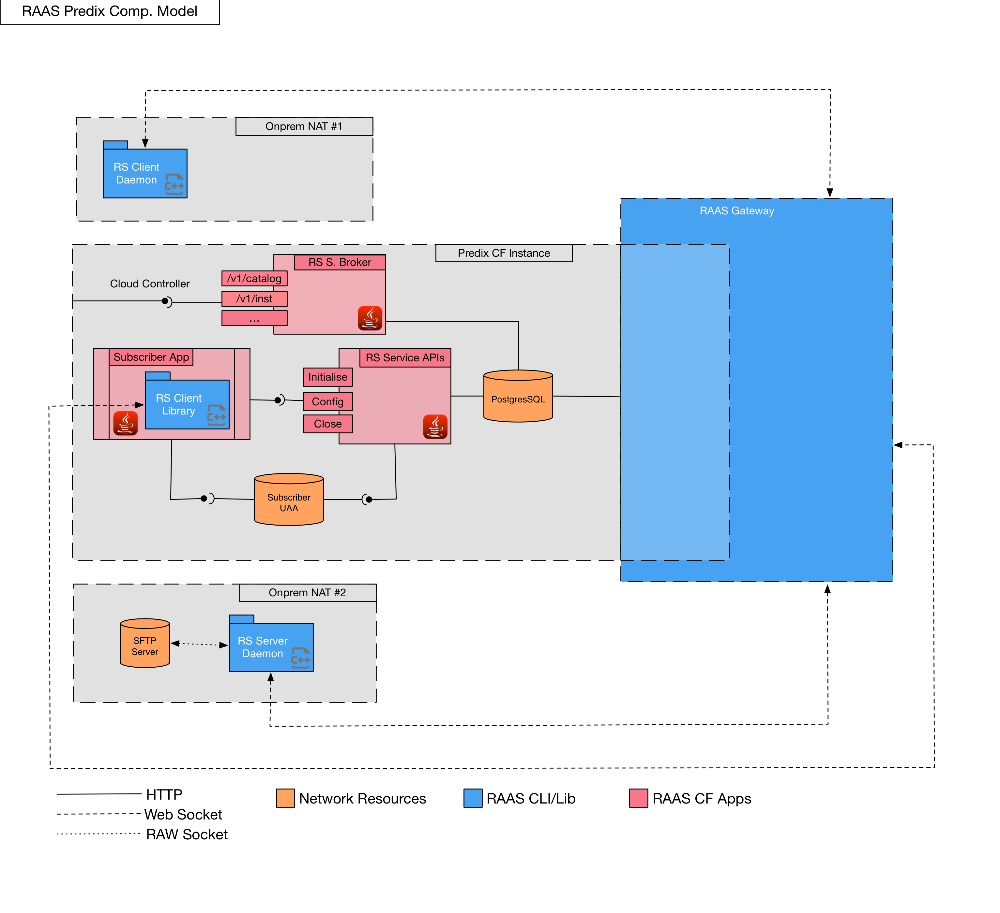
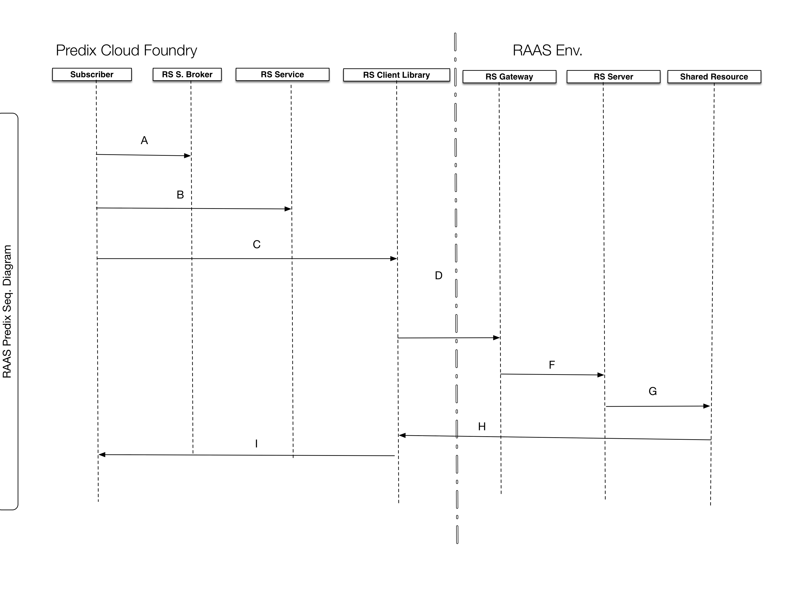

# RAAS Predix Gateway Service Usage Docs

* [Predix Composite Model](#predix-composite-model) 
* [Predix Sequence Diagram](#predix-sequence-diagram) 
* [Creating a RAAS Gateway Service Instance](#creating-a-raas-gateway-service-instance).
  * [Use the Cloud Foundry CLI to log into Cloud Foundry](#use-the-cloud-foundry-cli-to-log-into-cloud-foundry)
  * [List the services in the Cloud Foundry marketplace by entering](#list-the-services-in-the-cloud-foundry-marketplace-by-entering)
* [RAAS Gateway APIs](#raas-gateway-apis)
  * [Service URL](#service-url)
  * [Configuration](#configuration)
  * [Header](#header)
  * [Payload](#payload)
  * [HTTP Response](#http-response)
* [RAAS Client CLI/library/Daemon](#raas-client-clilibrarydaemon)
* [RAAS Server CLI/library/Daemon](#raas-server-clilibrarydaemon)

 
##Predix Composite Model


##Predix Sequence Diagram


##Creating a RAAS Gateway Service Instance
> Note: The following steps are performed using the Cloud Foundry CLI. To complete the steps in a web browser, follow the instructions on the service page in the Predix Catalog.

####Use the Cloud Foundry CLI to log into Cloud Foundry
```
cf login -a <API_Endpoint>
```

The value of <API_Endpoint> is available in the Predix Invitation email that you get when you sign-up to Predix.io. Depending on your Predix.io registration, the value of <API_Endpoint> is one of the following:

Predix Basic
https://api.system.aws-usw02-pr.ice.predix.io

Predix Select
https://api.system.asv-pr.ice.predix.io

####List the services in the Cloud Foundry marketplace by entering
```
cf marketplace
```
You see the available services and associated plans.

Create a RAAS Gateway Service instance by entering:
```
cf create-service raas_gateway <plan> <my_raas_gateway_instance> 
```

Use only alphanumeric characters, underscores (_), and hyphens (-) for your service instance name.
Where:

`<plan>` – the plan associated with the service.

`<my_raas_gateway_instance>` – the service instance you create.
Binding an Application to a RAAS Gateway Service Instance

Before binding an application to a Blobstore service instance, you must push your application to Cloud Foundry. From your application's project directory, on a command line, enter:
```
cf push <application_name>
```
You must bind your RAAS Gateway service instance to your application to provision connection details for your service instance in the VCAP environment variables. Cloud Foundry runtime uses VCAP_SERVICES environment variables to communicate with a deployed application about its environment.

Use the Cloud Foundry CLI to log into Cloud Foundry.
```
cf login
```

Bind your application to the service instance you created.
```
cf bind-service <application_name> <my_raas_gateway_instance>
```

Restage your application to ensure the environment variable changes take effect:
```
cf restage <application_name>
```

To view the environment variables for your application, enter:
```
cf env <application_name>
```

The command shows the environment variables, which contain your basic authorization credentials, client ID, and the endpoint URI, as shown in the following example:
```
"VCAP_SERVICES": {
  "raas-gateway": [
   {
    "credentials": {
     "client_id": "<client_id>",
     "server_id": "<server_id>",
     "load_balancer_uri": "<load_balancer_uri>",
     "predix_service_uri":"<predix_service_uri>"
     "zone-http-header-name":"Predix-Zone-Id",
     "zone-http-header-value":"<Predix-Zone-Id>",
     "zone-token-scopes":[
        "raas.zones.<Predix-Zone-Id>.user"
      ]
    },
    "label": "raas-gateway",
    "name": "<raas_gateway_service_instance>",
    "plan": "<plan>",
    "provider": null,
    "syslog_drain_url": null,
    "tags": [
     "raas-gateway",
     "raas predix gateway",
     "raas gateway"
    ]
   }
  ]
 }
}
```

##RAAS Gateway APIs

####Service URL
```
<predix_service_uri>/v1/setting
```

####Configuration

HTTP Request Method | Description
--- | ---
POST | Create the RAAS Gateway setting
PUT | Update the setting
GET | Get the current setting
DEL | Delete the setting

####Header
```
Authorization: Bearer <your UAA token>
Predix-Zone-Id: <Predix-Zone-Id>
Content-Type: application/json
```

####Payload
```javascript
{
    "<client_id>":{
        "auth":{  
        "type": "oauth",//oauth,basic 
        "clientId": "prasad-client1",
        "clientSecret": "hellopredix",
        "authUrl": "https://d1c6e280-56a6-4c5e-a0a8-62dae676b868.predix-uaa.run.aws-usw02-pr.ice.predix.io"
        },
        //cidr subnetting. ipv4/ipv6 suppported. gateway auto-detect if its a private ip
        "whiteList":[
        "::ffff:10.10.10.50/26",
        "3.10.11.141/28",
        "127.0.0.1/24"
        ],
        //ip address
        "blockList":[
        //'::ffff:127.0.0.1',
        "10.10.10.200",
        "10.10.10.205"
        ]
    },
    "<server_id>":{
        "auth":{  
        "type": "basic",
        "secret": "143434"
        },
        //cidr subnetting. ipv4/ipv6 suppported.
        "whiteList":[
        "::ffff:10.10.10.50/26",
        "3.10.11.141/28",
        "127.0.0.1/24",
        "10.72.12.0/24"
        ],
        //ip address
        "blockList":[
        //'::ffff:127.0.0.1',
        "10.10.10.200",
        "10.10.10.205"
        ]
    }
}
```

####HTTP Response
```
HTTP Status Code: 200
{
 "status":"Created",
 "Setting":<setting object>
}

HTTP Status Code: 201
{
 "status":"Updated",
 "Setting":<setting object>
}

HTTP Status Code: 301
{
 "status":"Deleted"
}

HTTP Status Code: 401
{
  "status":"Unauthorized"
}

HTTP Status Code: 500
{
  "status":"Internal Error"
}

```

##RAAS Client CLI/library/Daemon

##RAAS Server CLI/library/Daemon
