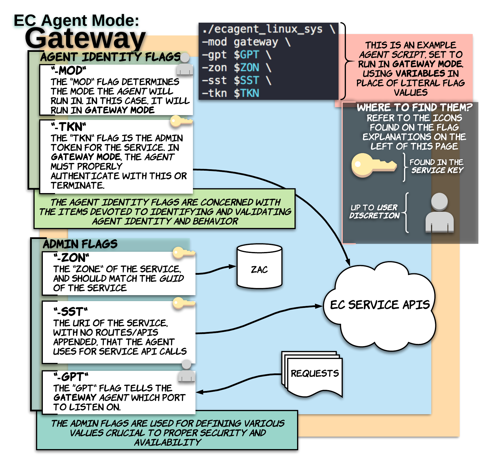
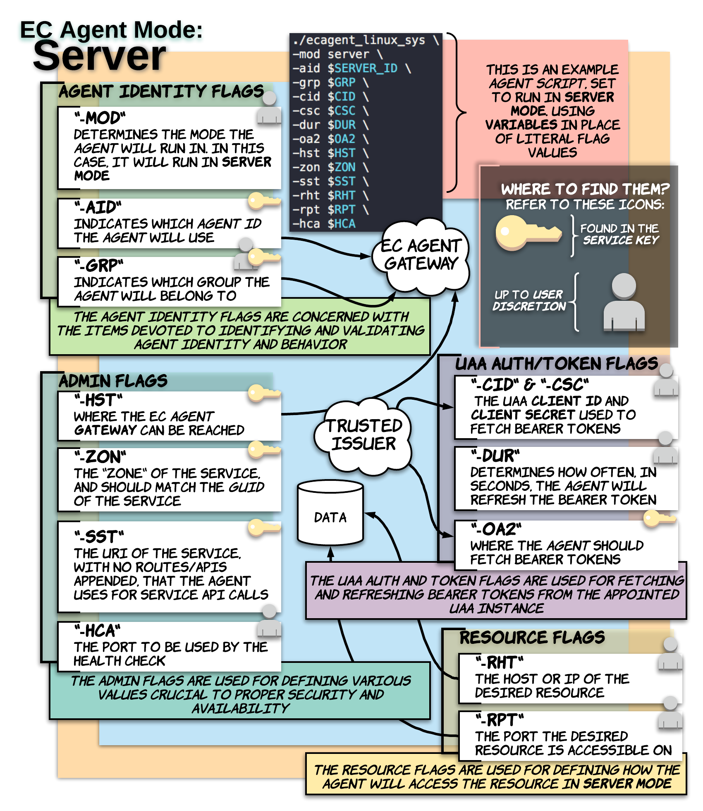
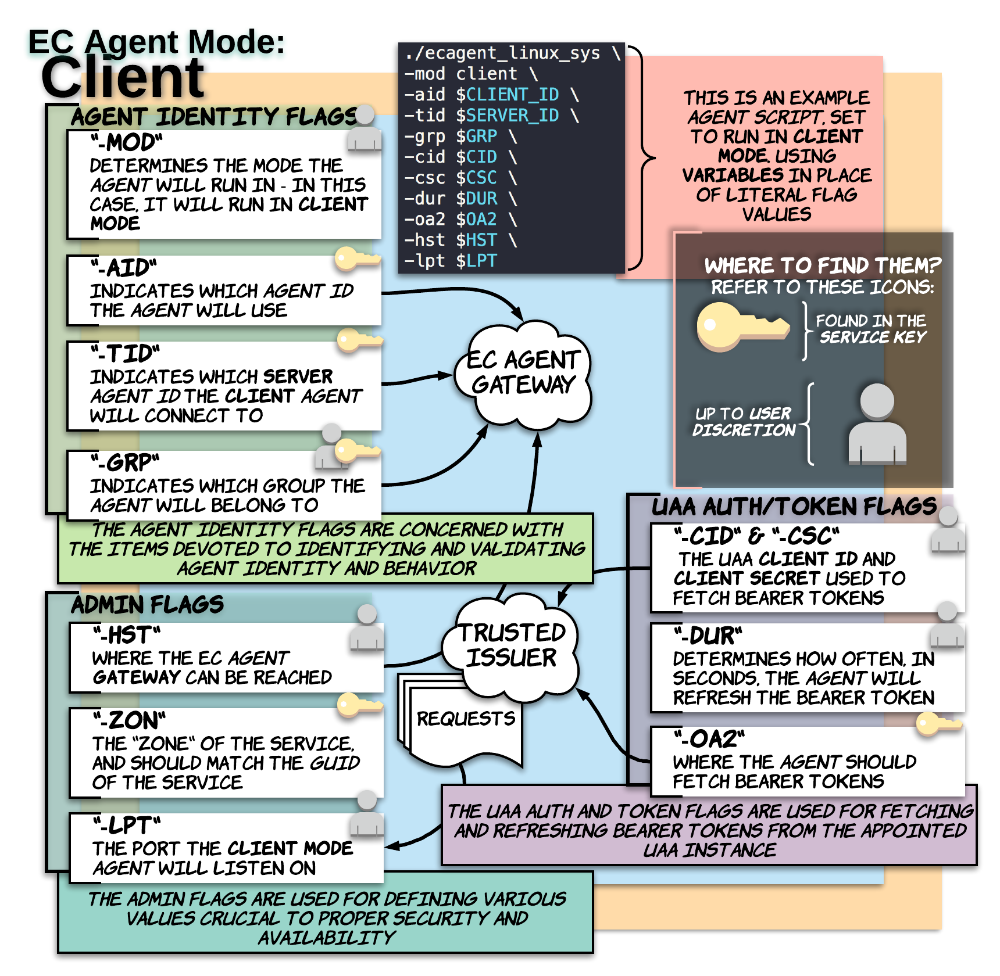
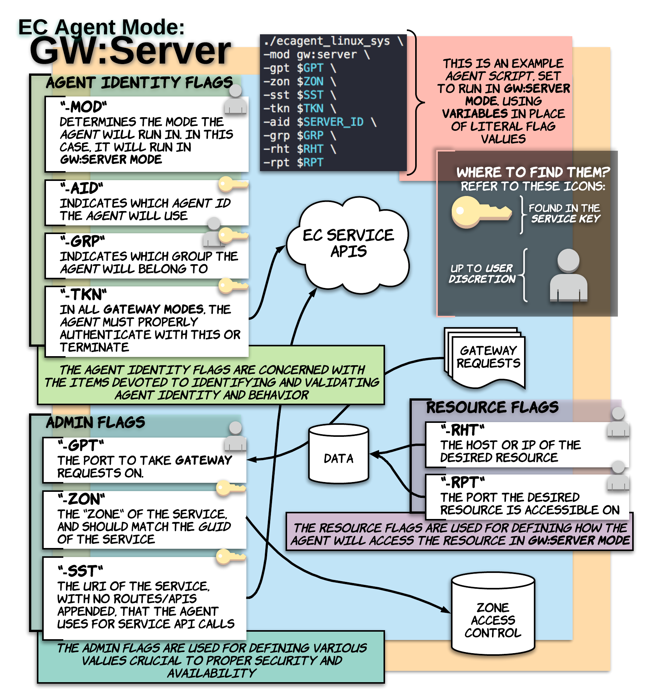
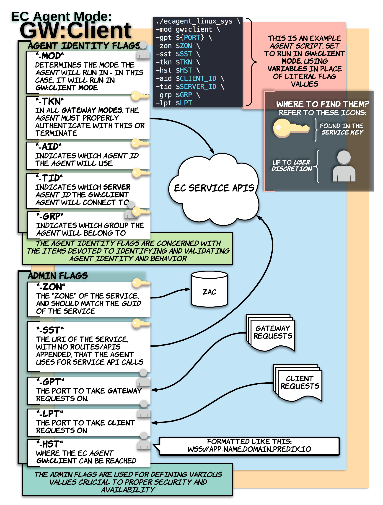
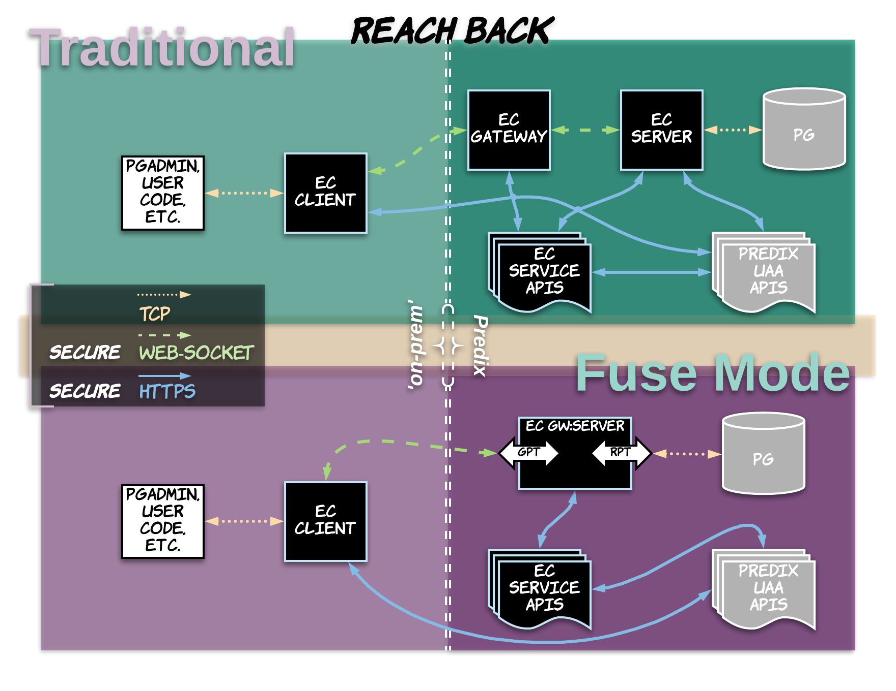
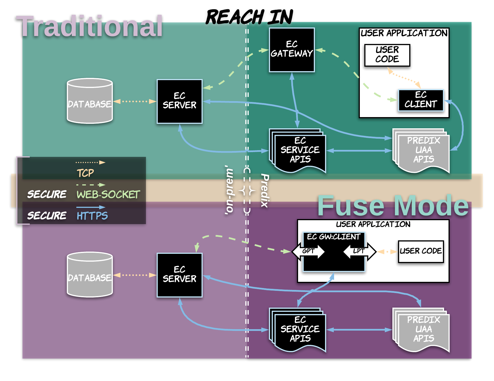
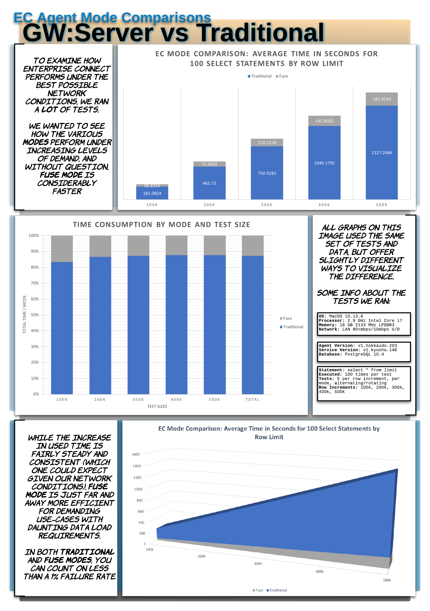

<A NAME="top">

# EC 'Modes' and Use-Case Examples

In this page you will be able to find all the answers for all things **'modes'**, in regards to Enterprise Connect (EC) implementations and *agents*. Please note that all links are placed for the ease of navigation in subsequent reads and visits, but the information is intended to be digestable in a flowing and linear way, start to finish.

* [What are 'Modes'?](#what-are-modes)
* [Choosing Between Modes](#choosing-between-modes)
* [Use-Case Mode Comparison](#use-case-mode-comparison)
* [EC Mode Speed Comparisons](#ec-mode-speed-comparisons)

## What are 'Modes'?

For the context of this page and topic, 'mode' can refer to one of five *agent* **modes**, or the choice between using **tradititonal** *agents* vs **fused** *agents*. 

---

First, on a high-level, we can look at the way in which the EC landscape is laid out as a 'mode' of sorts: either [**traditional mode**](#traditional-modes) which uses a [**traditonal** *agent gateway*](#gateway-mode), or [**fuse mode**](#fuse-modes) which combines either the *agent server* or *agent client* with the *agent gateway* into a single process which streamlines and reduces some network activity.

Then, on the *EC Agent* level, there are 5 distinct *agent* **modes** available: **gateway**, **server**, **client**, **gw:server**, and **gw:client**. Read and click on to learn more about these modes.

* [Choosing Between Modes](#choosing-between-modes)

### Traditional Modes

The **traditional mode** consists of running at least three *EC Agents*: a *server*, a *client*, and most importantly a **traditional** *gateway*. 

#### Gateway Mode
> The *EC Agent* running in **gateway mode** serves as the foundation for **client** and **server** interactions, by making available a 'public' URL that the other *agents* can access to establish a secure web-socket.

 

#### Server Mode
> The *EC Agent* running in **server mode** is configured to a specific 'resource', oftentimes a database, based on the resource's IP and port.

 

#### Client Mode
> The *EC Agent* running in **client mode** is configured to a specific *EC Agent* **server**, via *agent* ID, and listens ot a user-specified port on the localhost/127.0.0.1 where it is ran. Any connection string that would be valid for the remote resource the *EC Agent* **server** is configured for, can now be accessed locally by replacing the IP with 'localhost' and the port with the one the *EC Agent* **client** is listening on.

* [What are 'Modes'?](#what-are-modes)

<A HREF="#top">Back To Top</A>

### Fuse Modes

The **fuse mode** consists of running an *agent gateway* **fused** with either an *agent server* or *agent client*, and the complimentary, remaining *agent* **mode**. 

#### GW:Server Mode
> The *EC Agent* running in **gw:server mode** fuses the functionality of the **traditional** *agent gateway* and *agent server* into a single container and entity.

 

#### GW:Client Mode
> The *EC Agent* running in **gw:client mode** fuses the functionality of the **traditional** *agent gateway* and *agent client* into a single container and entity. (There are some additional considerations when running **gw:client mode** outside of Cloud Foundry that fall outside the scope of this light documentation)

* [What are 'Modes'?](#what-are-modes)

<A HREF="#top">Back To Top</A>

## Choosing Between Modes

While you can expect better overall performance from [**fuse mode**](#fuse-modes), some teams and use-cases may inherently favor the decoupling of *agents* for manageability or other considerations. Additionally, for existing EC configurations, switching over to [**fused**](#fuse-modes) from [**traditional**](#traditional-modes) may be more challenging than the potential gains merit. It is best to spend time exploring the pros and cons with all parties affected by configuration changes, but in the long run, [**fuse mode**](#fuse-modes) can provide better overall efficiency in terms of speed and failure rates (both [**fuse mode**](#fuse-modes) and [**traditional**](#traditional-modes) *agents* maintain less than a 1% failure rate based on postgres transactions that can not be summarily explained by failure of other actors).

* [What are 'Modes'?](#what-are-modes)
* [Traditional Modes](#traditional-modes)
* [Fuse Modes](#fuse-modes)

<A HREF="#top">Back To Top</A>

---

## Use-Case Mode Comparison

In the following diagrams, we explore how network activity is simplified in [**fuse mode**](#fuse-modes) compared to [**traditional**](#traditional-modes) by taking a look at the two most common use-cases which, with a little imagination, cover the vast majority of other, more complex use-cases.

### Cloud Data, GW:Server

> In this example, we need to get data from Postgres in Predix to an application on-prem, which has no way of natively communicating with the Postgres instance.

### On-Prem Data, GW:Client

> In this example, we need to 'reach in' to the GE Network to access data that is needed by our application in Cloud Foundry. We *must* 'embed' the *EC Agent client* in this application to run as a sub-process.

<A HREF="#top">Back To Top</A>

---

## EC Mode Speed Comparisons

In the following graphs and diagrams, we take a look at the difference in speeds between **traditional** EC configurations, **fuse mode**, and **direct** connections to a very basic table.

### Gateway, Server and Client vs GW:Server and Client

> In these tests, we compared how the **traditional** configuration compares to a **fuse mode**, **gw:server** based configuration.

<A HREF="#top">Back To Top</A>

---
