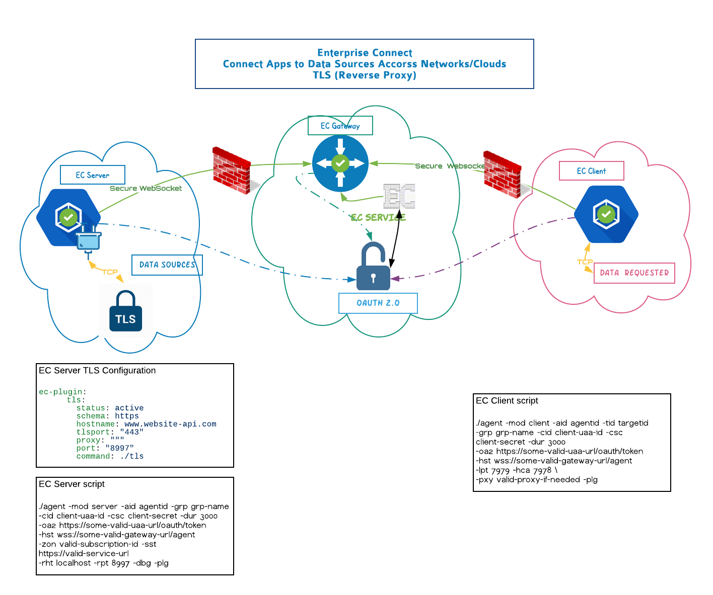

# TLS Plugin
TLS plugin for EC agent

TLS Plugin will create a secure connection between source and SSL enabled target system. 


Current stable versions for VLAN - 

 - beta: [v1beta](https://github.com/Enterprise-connect/sdk/tree/v1beta)
 - beta with watcher: [v1.1beta](https://github.com/Enterprise-connect/sdk/tree/v1.1beta)
 - prod: [v1](https://github.com/Enterprise-connect/sdk/tree/v1)
 - prod with watcher: [v1.1](https://github.com/Enterprise-connect/sdk/tree/v1.1)
 
### How it works

 
 
 

### EC Server setup

##### Folder structure


    {working dir}
    ├── ecagent                 # Get the latest stable binary
    ├── server.sh
    ├── plugins.yml
    └── tls_darwin_sys
    
##### Script 

```
./ecagent -mod server -aid agentid \
-grp group-name \
-cid uaa-client-id -csc uaa-client-secret -dur 3000 \
-oa2 https://some-valid-uaa-url/oauth/token \
-hst wss://some-valid-gateway-url/agent \
-zon valid-subscription-id -sst https://valid-service-url \
-rht localhost -rpt 9847 -hca 8001 -dbg -plg
```

Fields description - 

- <i>mod:</i> EC Agent mode - server/client/gateway
- <i>aid:</i> Server agent id - mandatory
- <i>grp:</i> EC service group - mandatory
- <i>cid:</i> UAA client id - mandatory
- <i>csc:</i> UAA client secret - mandatory
- <i>dur:</i> UAA token duration - mandatory
- <i>oa2:</i> OAuth2 URL for validation - mandatory
- <i>hst:</i> Gateway URL - mandatory
- <i>zon:</i> EC service zone id - mandatory
- <i>sst:</i> EC service URL - mandatory
- <i>rht:</i> Always use localhost for TLS
- <i>rpt:</i> Port number where host will listen
- <i>hca:</i> Port number to check agent health
- <i>dbg:</i> Enable debug mode
- <i>plg:</i> Flag to enable TLS features - mandatory
- <i>pxy:</i> Proxy flag - mandatory, when server agent running behind corporate proxy


##### plugins.yml 

```
ec-plugin:
  tls:
    status: active
    schema: https
    hostname: some.host.com
    tlsport: "443"
    proxy: ""
    port: "rpt"
    command: ./tls_darwin_sys
```

<b>Note</b>: 
- port must be same as rpt in server script
- give proxy value, if server script needed for connecting to website. If not, it is empty
- host name not required to include https://
- tls_darwin_sys must be same version as ec agent

<br/>

### EC Client setup

##### Folder structure

    {working dir}
    ├── ecagent                 # Get the latest stable binary
    
##### Script

```
./agent -mod client \
-aid agentid -tid target-agentid -grp group-name \
-cid uaa-client-id -csc uaa-client-secret -dur 3000 \
-oa2 https://some-valid-uaa-url/oauth/token \
-hst wss://some-valid-gateway-url/agent \
-lpt 7979 -hca 7978 \
-pxy http://PITC-Zscaler-Americas-Alpharetta3pr.proxy.corporate.ge.com:80 -plg 
```

Fields description - 

- <i>mod:</i> EC Agent mode - server/client/gateway
- <i>aid:</i> Client agent id - mandatory
- <i>tid:</i> Server agent id - mandatory
- <i>grp:</i> EC service group - mandatory
- <i>cid:</i> UAA client id - mandatory
- <i>csc:</i> UAA client secret - mandatory
- <i>dur:</i> UAA token duration - mandatory
- <i>oa2:</i> OAuth2 URL for validation - mandatory
- <i>hst:</i> Gateway URL - mandatory
- <i>lpt:</i> Local port for connecting to target - mandatory
- <i>hca:</i> Port number to check agent health
- <i>dbg:</i> Enable debug mode
- <i>plg:</i> Flag to enable plugins - mandatory
- <i>pxy:</i> Proxy flag - mandatory, when client agent running behind corporate proxy


#### Helpful Tips

- TLS connection logs can be found in client machine at - 

```
~/.ec/connectivity.log
~/.ec/tlsplugin.log
```        
