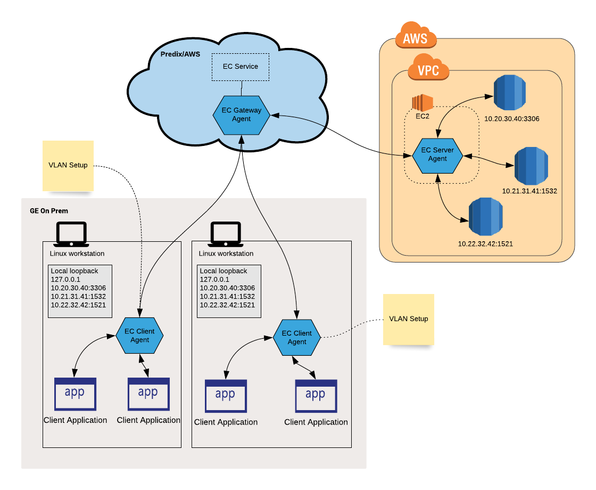

# VLAN Plugin
VLAN plugin for EC agent

Current stable versions for VLAN - 

 - beta: v1beta.fukuoka.1724
 - prod: v1.hokkaido.212
 
### Sample use case for VLAN

 
 
 

### EC Server setup

##### Folder structure


    {working dir}
    └── ecagent                 # Get the latest stable binary
    
##### Script 

```
./ecagent -mod server -aid y0RG7s \ 
-grp group-name -cid client-uaa-id -csc client-secret \
-dur 3000 -oa2 https://uaaurl.predix-uaa.run.aws-usw02-dev.ice.predix.io/oauth/token \
-hst wss://gateway-url/agent \
-zon 1ce65a3b-8c8f-43aa-b1d3-00e03e02f407 \
-sst https://1ce65a3b-8c8f-43aa-b1d3-00e03e02f407.run.aws-usw02-dev.ice.predix.io \
-rht localhost -rpt 1575 -hca 8081 -dbg -vln
```

Fields description - 

- <i>mod:</i> EC Agent mode - server/client/gateway
- <i>aid:</i> Server agent id - mandatory
- <i>grp:</i> EC service group - mandatory
- <i>cid:</i> UAA client id - mandatory
- <i>csc:</i> UAA client secret - mandatory
- <i>dur:</i> UAA token duration - mandatory
- <i>oa2:</i> OAuth2 URL for validation - mandatory
- <i>hst:</i> Gateway URL - mandatory
- <i>zon:</i> EC service zone id - mandatory
- <i>sst:</i> EC service URL - mandatory
- <i>rht:</i> Remote host. Dummy flag in VLAN
- <i>rpt:</i> Remote port. Dummy port in VLAN
- <i>hca:</i> Port number to check agent health
- <i>dbg:</i> Enable debug mode
- <i>vln:</i> Flag to enable VLAN features - mandatory
- <i>pxy:</i> Proxy flag - mandatory, when server agent running in 'on prem'

### EC Client setup

##### Folder structure

    {working dir}
    ├── ecagent                 # Get the latest stable binary
    ├── plugins.yml             # Refer example below
    └── vln                     # Get same version of vln binary
    
##### Script

```
./ecagent -mod client \
-aid mUQJya -tid y0RG7s \
-grp group-name \
-cid client-uaa-id -csc client-secret -dur 3000 \
-oa2 https://uaaurl.predix-uaa.run.aws-usw02-dev.ice.predix.io/oauth/token \
-hst wss://gateway-url/agent \
-lpt 7979 -rpt 1575,1525  \
-pxy http://PITC-Zscaler-Americas-Alpharetta3pr.proxy.corporate.ge.com:80 -dbg -plg -vln
```

Fields description - 

- <i>mod:</i> EC Agent mode - server/client/gateway
- <i>aid:</i> Client agent id - mandatory
- <i>tid:</i> Server agent id - mandatory
- <i>grp:</i> EC service group - mandatory
- <i>cid:</i> UAA client id - mandatory
- <i>csc:</i> UAA client secret - mandatory
- <i>dur:</i> UAA token duration - mandatory
- <i>oa2:</i> OAuth2 URL for validation - mandatory
- <i>hst:</i> Gateway URL - mandatory
- <i>lpt:</i> Local port for connecting to target - mandatory
- <i>rpt:</i> Remote ports seperated by comma - mandatory
- <i>hca:</i> Port number to check agent health
- <i>dbg:</i> Enable debug mode
- <i>vln:</i> Flag to enable VLAN features - mandatory
- <i>plg:</i> Flag to read plugins.yml - mandatory
- <i>pxy:</i> Proxy flag - mandatory, when client agent running in on prem


##### plugins.yml - 

```

--- 
ec-plugin: 
  vlan: 
    command: ./vln_linux_sys
    ips: 10.10.10.78/32,10.10.18.98/32
    status: active
```

<b>Note</b>: EC client must always run by sudo user